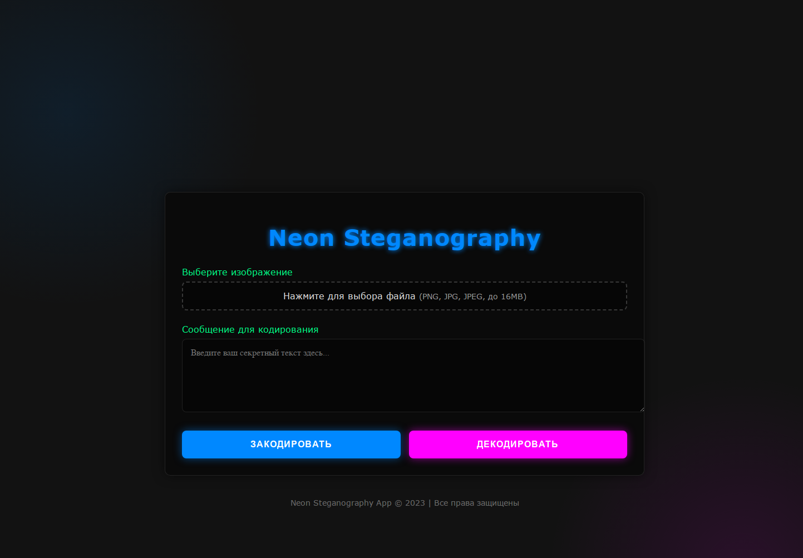

# Neon Steganography 🔐✨

[](https://python.org)
[](https://flask.palletsprojects.com/)
[](https://opensource.org/licenses/MIT)

Приложение для скрытой передачи сообщений в изображениях с неоновым дизайном. Кодируйте текст в картинки и декодируйте его с помощью LSB-стеганографии.

 <!-- Замените на реальный скриншот -->

## 🌟 Особенности

- **Кодирование текста** в изображения (PNG, JPG)
- **Декодирование** скрытых сообщений
- **Неоновый UI** с адаптивным дизайном
- **Защита данных**: 
  - Валидация форматов файлов
  - Ограничение размера загрузки (16MB)
- Поддержка UTF-8 текста

## 🚀 Быстрый старт

### Установка
1. Клонируйте репозиторий:
   ```bash
   git clone https://github.com/ваш-username/Neon-Steganography.git
   cd Neon-Steganography
